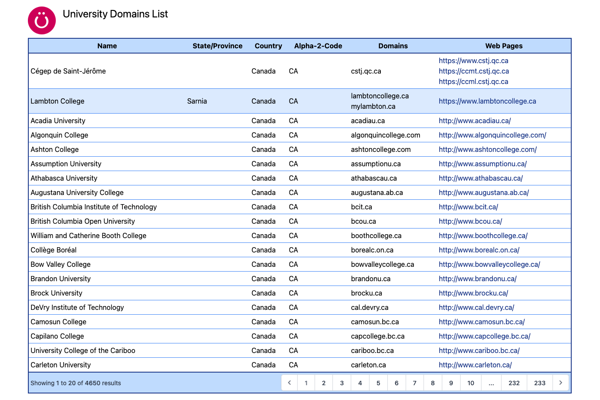

# Uberflip Engineer II Technical Challenge

## Technology Used

- [Git](https://git-scm.com/)
- [Github](https://github.com)
- [Gitpod](https://gitpod.io)
- [Docker](https://docker.com)
- [NGINX](https://nginx.org)
- [MySQL](https://dev.mysql.com/doc/refman/8.0/en/)
- [PHP CodeSniffer](https://github.com/squizlabs/PHP_CodeSniffer)
- [Laravel](https://laravel.com) (Optional)
  - [Tailwind CSS](https://laravel.com/docs/8.x/mix#tailwindcss)

## Your Tasks

1. Consume the `University Domains and Names API` public API that is found [here](https://github.com/Hipo/university-domains-list-api).  Using an Object Oriented approach, return and parse the list of all universities in Canada and the US.  Store the information in a MySQL database using best practice for table normalization. Please include the schema or migrations.  The API should only be consumed once, then the locally stored data should be used to populate the application.

2. Present the list of universities and highlight the ones that have more than one domain.  Make the presentation of this data clean and have some styling.

3. Ensure that your code is well formatted, commented, and tested.  When you are finished, add your interviewers as collaborators on your repo.

### Sample Mockup

## Development Environment

You will need a personal Github account to accomplish this challenge.  Once you have a Github account, go to [Gitpod](https://gitpod.io) and sign up for an account using your Github account.  If you prefer, you may install the [Gitpod extension](https://www.gitpod.io/docs/browser-extension) for your browser, this will add a "Gitpod" button to any Github repo that will open a workspace based on that repo.

The Gitpod environment provides an instance of [VS Code](https://code.visualstudio.com/) in the browser for you to accomplish your tasks.  You may install any additional tools you need using the [Gitpod](https://www.gitpod.io/docs/getting-started) or [Docker](https://docs.docker.com/compose/) config files.  Make sure that any tools your solution requires are installed and configured in code, otherwise your interviewer will not be able to replicate your solution.

If you close a preview window, you can re-open it by clicking on the Remote Explorer tab on the left-hand sidebar.  Find the port you want to preview (e.g. `8080`) and click the Open Preview or Open Browser icon.  Some pages will work better in a Broswer window as opposed to a Preview tab.

If you are having issues with the font in the terminal windows being hard to read, try adding `"terminal.integrated.gpuAcceleration": "canvas"` to the settings.json file in VS Code.

## Setting up a Framework

You may choose which framework you wish to use to accomplish your tasks.  We have prepared an install script for one framework, Laravel, but you may choose any framework to accomplish your tasks.  Please follow the instructions below to install the framework of your choice.

1. Copy this template repo to your own Github account.
2. Start a Gitpod workspace from your copy of the repo (prepend [https://gitpod.io#](https://gitpod.io#) to the Github URL).  This step may take 5-10 minutes to initialize the image.
3. Continue with Laravel or install your preferred framework.

### [Laravel](https://laravel.com)

1. Run `bash install-laravel.sh` from the Terminal window.  This will install Laravel Sail and make the needed Gitpod config changes.
2. Using the VS Code Source Control tab, commit all new & changed files (1k+) with the commit message "Initial Commit" and click Sync Changes.
3. Close the existing workspace.
4. Open a new workspace from your git repo with your committed changes.  Once VS Code loads, it may take 5-10 minutes for Sail to finish installing.  You can monitor the progress by clicking on the Laravel Sail terminal in the bottom-right corner.

When Sail is ready, a preview window will open.  The preview page should now look like this:

[Tailwind CSS](https://laravel.com/docs/8.x/mix#tailwindcss) is also included for you.  You are now ready to start your tasks.

## Available Services

There are some services available for you to use if you wish. Instructions are included below to help you get started.

### NGINX (Web Server)

Available on port `8080`.  Default config is in /config/nginx.conf and it will serve content out of /web/.

### MySQL 8 (Database)

Available on port `3306`.  An instance of Adminer has been provided on port `8033` as well.  To access it, use the Remote Explorer tab and Preview the port.  These options have been preset for you in the CLI config.

- Username: uberflip
- Password: pass123
- Database: university

Note: The MySQL instance may take a few minutes to start up, check the Docker output to make sure it is ready otherwise you will get connection errors.

### [PHP CodeSniffer (Linter)](https://github.com/squizlabs/PHP_CodeSniffer)

1. Run `composer phpcs /path/of/file` to evaluate the code
2. Run `composer phpcbf /path/of/file` to fix code using default coding standard

Note: Default coding standard is set to PSR2
